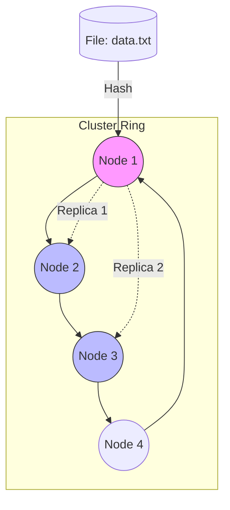

# HyDFS: High-Performance Distributed File System


**HyDFS** is a robust, fault-tolerant distributed file system built in Go. Designed for reliability and performance, it implements a dynamic ring topology with consistent hashing, ensuring high availability and seamless scalability across distributed clusters.

---

## 🚀 Key Features

*   **Elastic Scalability**: Nodes can join or leave the cluster dynamically. Consistent hashing ensures minimal data movement during topology changes.
*   **High Availability**: 3-way replication (R=2, W=2 quorum) ensures data survives node failures.
*   **Fault Tolerance**: Integrated SWIM-style failure detection (Ping/Ack + Suspicion) automatically identifies and handles failed nodes.
*   **Strong Consistency**: Read-your-writes and sequential consistency guarantees for append operations.
*   **Automatic Self-Healing**: The system detects failures and automatically re-replicates under-replicated data to healthy nodes.

---

## 🏗 System Architecture

HyDFS uses a **Consistent Hashing Ring** to manage data placement.

*   **Partitioning**: Files are hashed to a point on the ring and stored on the successor node.
*   **Replication**: Each file is replicated to the next 2 successors in the ring, ensuring 3 copies.
*   **Membership**: A gossip-based membership protocol (SWIM variation) maintains the view of the cluster state.



### Protocol Highlights
*   **Write Path**: Client -> Primary Replica -> Successors (Quorum Wait) -> Ack
*   **Read Path**: Client -> Primary/Replica (Load Balanced) -> Data
*   **Failure Recovery**: When Node X fails, its predecessor detects the failure and initiates re-replication of X's primary data to the new replica targets.

---

## 📊 Performance Analysis

We subjected HyDFS to rigorous stress testing to evaluate its behavior under load and failure conditions.

### 1. Rebalancing Overhead (Scale-Out)
When a new node joins, the system must transfer a subset of files to it to balance the load.


*   **Trend**: Rebalancing time grows linearly with the number of files, while network bandwidth consumption plateaus at ~4 Mbps due to our sophisticated throttling mechanism.
*   **Design Choice**: We prioritized **safety over speed**. A 200ms throttle between file transfers prevents the rebalancing process from saturating the network and impacting foreground client traffic.

### 2. Merge Performance (Write Latency)
We measured the latency of merging concurrent appends from multiple clients.


*   **Result**: The system demonstrates stable latency characteristics even as file size increases, validating the efficiency of our append-only storage engine.

---

## 🛠 Getting Started

### Prerequisites
*   Go 1.21+
*   SSH access between nodes
*   `hosts.txt` configured with cluster hostnames

### Cluster Management (`scripts/cluster.sh`)
Refined orchestration scripts make managing the 10-VM cluster effortless.

```bash
# 1. Start the cluster (VM1 becomes the introducer)
./scripts/cluster.sh start

# 2. Check cluster status via logs
./scripts/cluster.sh logs "MEMBERSHIP STATUS"

# 3. Stop all nodes
./scripts/cluster.sh stop
```

### CLI Usage
HyDFS provides a familiar command-line interface.

```bash
# Create a file in HyDFS
./main -cmd create local_image.png hydfs_image.png

# Read a file
./main -cmd get hydfs_image.png retrieved_image.png

# Append data
./main -cmd append local_data.txt hydfs_target.txt

# Inspect file list
./main -cmd ls hydfs_target.txt
```

---

## 🧪 Verified Scenarios

The system has passed a comprehensive suite of integration tests:

| Test Script | Scenario | Purpose |
| :--- | :--- | :--- |
| `test1` | **Sequential Writes** | Verifies basic creation and data integrity. |
| `test2` | **Replica Verification** | Confirms correct placement of all 3 replicas on the ring. |
| `test3` | **Failure Recovery** | Kills 2 nodes and verifies that data is re-replicated to restore 3-way redundancy. |
| `test4` | **Append Ordering** | Ensures concurrent appends result in consistent file ordering. |
| `test5` | **Concurrent Stress** | Heavy load test with multiple clients appending and merging simultaneously. |

---

## 📁 Project Structure

*   `main.go`: Entry point for the Node Daemon and CLI.
*   `hydfs/`: Core Distributed File System logic (Storage, Replication, HTTP Server).
*   `utils/`: Shared libraries for Networking and Membership.
*   `measurements/`: Data and plots from performance experiments.
*   `scripts/`: DevOps scripts for cluster deployment and testing.